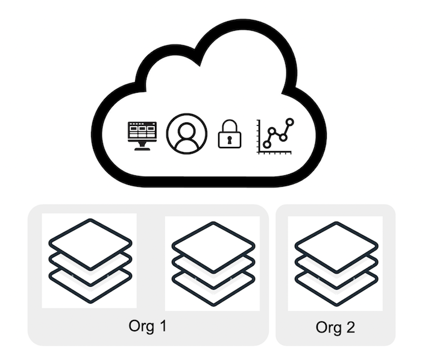

# Nile Examples


## Overview

This collection of examples demonstrates how to use Nile as a control plane for an Infrastructure SaaS product.
Nile provides an entity system, event system, and tenant-aware metrics.

The mock scenario in these examples is a company that provides SaaS. 



These examples let you choose what kind of SaaS offering is provided, one of:

- [Clusters as a Service](usecases/clusters/) (same as in the Nile Quickstart)
- [Database as a Service](usecases/DB/)
- [SkyNet as a Service](usecases/SkyNet/)
- [Banking as a Service](usecases/Banking/)
- [Workload as a Service](usecases/Workload/)
- [YOLO](usecases/README.md#yolo)

### Where to start

First decide which offering you want to use, then run the Quickstart to setup your control plane in Nile.
Follow on with any of the other modules for different use cases.
The modules can also be run sequentially to build on top of one another, in which case, we recommend running them in the order presented here to build up your SaaS as you go.
Finally, after you run the webapp example which includes a front-end for self-service provisioning, a user can log in to read and create new entity instances, for example:


And view metrics for each of their instances:


## Contents

* [Overview](#overview)
* [Setup](#setup)
* [Quickstart](#quickstart)
* [Multi-tenancy](#multi-tenancy)
* [Data Plane](#data-plane)
* [Authorization](#authorization)
* [Webapp](#webapp)

## Setup

To run these examples:

1. You must have access to Nile, please [reach out](https://www.thenile.dev) for more information.

2. Validate your environment has the minimum required Node version v18.0.0 or higher. If you are running earlier versions, you may encounter errors such as `ReferenceError: fetch is not defined`. (If you use `nvm`, run `nvm use`).
   
3. Obtain the following parameter values that represent your control plane configuration in Nile.
These can be an existing control plane or a new one will be created for you from these values.
`NILE_ENTITY_NAME` refers to one of the [usecases](usecases/).

   - `NILE_URL`
   - `NILE_WORKSPACE`
   - `NILE_DEVELOPER_EMAIL`
   - `NILE_DEVELOPER_PASSWORD`
   - `NILE_ORGANIZATION_NAME`
   - `NILE_ENTITY_NAME`: choose one of the [usecases](usecases/)

   At the top-level of the examples repo, copy the [.env.defaults](.env.defaults) file to `.env` and set the values in this `.env` file to match the values you want in your control plane.  It will be used for all the examples.

   ```bash
   cp .env.defaults .env
   ```

> Note: the languages presented below are an indication just of which examples have been developed, not of what's available.
> Please see the Nile API and SDK documentation for details.

## Quickstart

Start with the quickstart to configure a base Nile control plane.
This provides a simple setup to learn the concepts but also serves as the foundation for the other examples below.

- [Quickstart](quickstart) | JS SDK | Setup a minimal Nile control plane with a single tenant

## Multi-tenancy

Tenants have access to specific organizations that have isolated sets of resources.
Users are allowed to access only the entity instances in the organizations to which they have been added.

- [Multi-tenancy](multi-tenancy/) | JS SDK | Setup the Nile control plane with multiple tenants and users

## Data Plane

These examples show how to synchronize, e.g. reconcile, your data plane and control plane in real time with Nile events.
As instances are created or destroyed from the control plane, the example reconciler creates or destroys data plane deployments.
Even if you're using another deployment tool like Kubernetes or Terraform, similar principles apply as they do for Pulumi.

- [Data Plane with Pulumi](data-plane/pulumi/) | JS SDK | Synchronize your data plane and control plane
- [Data Plane with Apache Flink and Kubernetes](data-plane/k8s/)  | JS SDK | Synchronize a control plane built with Nile with data plane that uses Apache Flink and Kubernetes

## Authorization

Attribute-based access control (ABAC) is an authorization model that gives you fine-grained authorization capabilities.
You can configure these in the control plane so that they are aligned to your business's security policies.

- [Authorization](authz/) | JS SDK | Use ABAC to grant and revoke permissions to resources
- [Authorization App Backend](authz-be/) | JS SDK | Authorize users against Nile control plane for your backend applications
- [Authorization with Python](authz-python/) | Python REST | Use ABAC to grant and revoke permissions to resources

## Webapp

Configure a front-end web application that is customizable on a per-tenant basis.
The webapp includes Nile React components for metrics, because it is critical for any SaaS to be able to measure and monitor consumption and do accurate tenant billing.
These metrics can be exposed externally to the end user as well as internally for business operations.

- [Webapp](webapp/) | JS SDK | Builds a self-service frontend that integrates with Nile on the backend

## Other

Here are additional examples that you can refer to.

- [Python + Flask Todo List Webapp](python-flask-todo-list/) | Python REST | Take a basic Todo List webapp written in Python and Flask and turn it to a PLG SaaS product with Nile APIs
