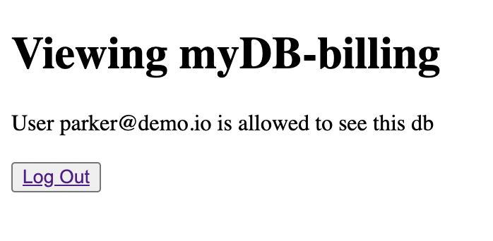

# Authorization on the Backend


## Overview

This example demonstrates how to use your existing backend applications and add a middleware to use authorization from Nile.
It starts with an application that does just basic user authentication and then layers in [authorization](middleware/authz-nile.ts) by calling out to Nile to validate the logged in user is allowed to access the resources.

Credit: the base example of the webapp is heavily borrowed from this [authentication guide](https://github.com/LoginRadius/engineering-blog-samples/tree/master/NodeJs/NodejsAuthenticationGuide).

## Install Dependencies

1. Run the following command:

```
yarn install
```

Your output should resemble:

```bash
yarn install v1.22.19
warning package.json: No license field
warning No license field
[1/4] 🔍  Resolving packages...
[2/4] 🚚  Fetching packages...
[3/4] 🔗  Linking dependencies...
[4/4] 🔨  Building fresh packages...
✨  Done in 2.26s.
```

2. For the web application and database:

- Install and run MongoDB

  - [Install mongoDB](https://www.mongodb.com/docs/manual/tutorial/install-mongodb-on-os-x/)
  - run MongoDB in the background: `mongod --config /opt/homebrew/etc/mongod.conf &`
  - [Install mongosh](https://www.mongodb.com/docs/mongodb-shell/install/), a MongoDB CLI for logging in and cleanup

## Setup

For all examples, you need a local file with your Nile configuration.
For that purpose, at the top-level of the examples, copy the `.env.defaults` file to `.env`:

```bash
# From the top level of the examples folder
$ examples> cp .env.defaults .env
```

Set the values in this `.env` file to match the values you want in your control plane.

## Execute

1. First run the [application](server-without-authz.js) without Nile authorization:

```
yarn start-without-authz
```

Use any browser to go to `http://locahost:5000`. Login with any of the listed users and then click `Test authz` to the variety of pages.
Notice that all the users have access to all the pages: `page1`, `page2`, `page3`.

2. Now run the [application](server.js) with Nile authorization.

```
yarn start
```

This time, in addition to running the application, it also sets up the [Nile control plane](src/index.ts), defines entities and entity instances that correspond to the application pages, adds users to different organizations, and configures authorization policies as defined below.
These examples already provide one of the following offerings:

- [Database as a Service](../usecases/DB/)
- [SkyNet as a Service](../usecases/SkyNet/)
- [Banking as a Service](../usecases/Banking/)
- [Clusters as a Service](../usecases/clusters/)
- [YOLO](../usecases/README.md#yolo)

3. View the code changes required for this example application:

```
diff server.js server-without-authz.js
```

4. View the example [Nile authorization code](middleware/authz-nile.ts).


## Validate

1. Log into the [Nile Admin Dashboard](https://nad.thenile.dev/) to see the control plane and entity instances.
For the email and password, use the `NILE_DEVELOPER_EMAIL` and `NILE_DEVELOPER_PASSWORD` values you specified in the `.env` file.

2. Cross-check which users are authorized to see which pages.  For example, if you used the `Database as a Service` use case, `parker@demo.io` is in org `customer-org-1` which has entities for `myDB-products`(=page1) and `myDB-billing`(=page2).  Therefore when `parker@demo.io` tries to view either of those entities, he will be able to see those pages:



But if `shaun@demo.io` tries to view `myDB-analytics`(=page2) which belongs to a different org `customer-org-2`, he will not be able to see the page:


## MongoDB cheatsheet

Run `mongosh` to connect to your local database, here are some useful commands:

```
use role_auth;
db.users.find();
db.pages.find();
```

To cleanup and shutdown your local MongoDB collections:

```
db.users.drop();
db.pages.drop();
db.shutdownServer()
```

This script will drop those tables and drop ALL policies for those organizations:

```
yarn clean
```
