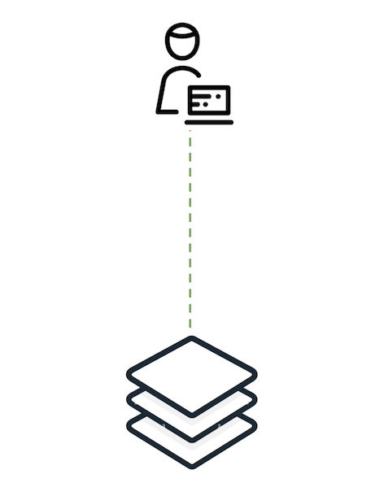
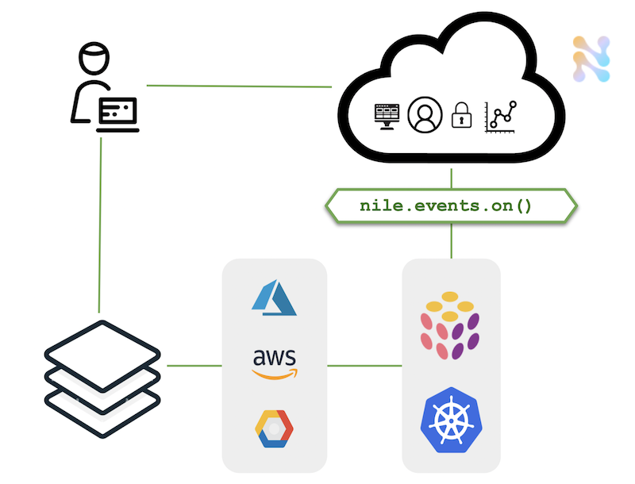

# Deploy Apache Flink to K8s with Nile Example #


## Overview

As described in the [top-level README](../../README.md), the mock scenario in these examples is a company that provides SaaS.

Consider an end user who logs into the SaaS and wants to provision a new instance of the service offering:



This example demonstrates how to leverage Nile events to synchronize (i.e., `reconcile`) the data
plane and control plane in real time.



Nile doesn't prescribe any particular data plane deployment solution. Here we'll be
using [Apache Flink's Operator](https://github.com/apache/flink-kubernetes-operator) to deploy objects into Kubernetes. 
Note: this example runs only with `NILE_ENTITY_NAME=FlinkDeployment`.

> If your data plane is something other than Flink jobs or does not use Kubernetes, replace 
> the [`FlinkDeploymentService`](./src/service/FlinkDeploymentService.ts) 
> class in this example with your own deployment implementation.

### Credit
This example was contributed by Yaroslav Tkachenko (@sap1ens) and [Goldsky](https://goldsky.com/). The Nile team appreciates all their help and feedback.

## Contents

* [Overview](#overview)
* [Prerequisites](#prerequisites)
* [Setup](#setup)
* [Configure the Control Plane](#configure-the-control-plane)
* [Configure the Data Plane](#configure-the-data-plane)
* [Run the reconciler](#run-the-reconciler)
* [Explanation](#Explanation)
* [Add or remove instances](#add-or-remove-instances)

## Prerequisites ##

This example assumes you have:

* Kubernetes cluster and ability to execute `kubectl` commands from your development environment. [Kind](https://kind.sigs.k8s.io/) is great for local testing
* [Helm installed](https://helm.sh/docs/intro/install/)
* [OpenAPI code generator installed](https://openapi-generator.tech/docs/installation/#homebrew)
* A Nile developer account using an email address and password

## Setup

For all examples, you need a local file with your Nile configuration.
For that purpose, at the top-level of the examples, copy the `.env.defaults` file to `.env`:

```bash
# From the top level of the examples folder
$ examples> cp .env.defaults .env
```

Set the values in this `.env` file to match the values you want in your control plane.

## Configure the Control Plane ##

There are a few ways to configure the control plane:

- [Nile Admin Dashboard](#nile-admin-dashboard): use the UI to manually configure the control plane
- [Programmatically](#programmatically): use the provided script which leverages the Nile SDK

### Nile Admin Dashboard

> If you're not familiar with the terminology used below, read the
> [Nile Quickstart](https://www.thenile.dev/docs/current/quick-start-ui).

For the values below, make sure they match what you set in the `.env` file.

1. Login to the [Nile Admin Dashboard](https://nad.thenile.dev/).
2. If there isn't one already, create a workspace and give it a unique name, "gwen-flink-jobs" for example.
3. Create an entity type called `FlinkDeployment` from [this definition](./spec/FlinkDeployment.json), which is also available as a template from the Nile Admin Dashboard.
4. Create an organization in the workspace named "sac-norad".
5. Create a "FlinkDeployment" instance in the organization, with a value that matches 
   the schema defined earlier:

```json
{
  "spec": {
    "job": {
      "jarURI": "local:///opt/flink/examples/streaming/StateMachineExample.jar",
      "parallelism": 2,
      "upgradeMode": "STATELESS"
    },
    "jobManager": {
      "replicas": 2,
      "resource": {
        "cpu": 1,
        "memory": "2048m"
      }
    },
    "taskManager": {
      "resource": {
        "cpu": 1,
        "memory": "2048m"
      }
    },
    "flinkConfiguration": {
      "taskmanager.numberOfTaskSlots": 2
    }
  },
  "metadata": {
    "name": "basic-example"
  }
}
```
6. Nile generated an OpenAPI spec for the entity. Navigate to the `Open API` tab in the `Entities` page and copy the API definition to a file called `spec/FlinkDeployment.yaml`.

```bash
openapi-generator generate -i spec/FlinkDeployment.yaml -g typescript -o generated/openapi
```

### Programmatically

1. Install the project dependencies

```bash
yarn install  --ignore-engines
```

2. Configure the control plane. This command will read from the `.env` file you defined earlier and create a workspace, tenant organization, FlinkDeployment entity and an example Flink job. The script is idempotent and instances will be created only once.

```bash
yarn setup-nile
```

3. In the previous step you created a FlinkDeployment entity. Nile automatically generated an OpenAPI spec for the entity, which our script then downloaded. 
4. Generate FlinkDeployment JS module from the entity spec: 

```bash
openapi-generator generate -i spec/FlinkDeployment.yaml -g typescript -o generated/openapi
```
## Configure the data plane ##

This example uses the [Apache Flink Operator](https://github.com/apache/flink-kubernetes-operator).

1. Install Flink Operator from a helm chart:

```bash 
helm repo add flink-operator-repo https://downloads.apache.org/flink/flink-kubernetes-operator-1.1.0
helm install flink-kubernetes-operator flink-operator-repo/flink-kubernetes-operator
```

2. You can verify the installation by running:

```bash
helm list && kubectl get pods
```

which should print output similar to:

```bash
NAME                     	NAMESPACE	REVISION	UPDATED                             	STATUS  	CHART                          	APP VERSION
flink-kubernetes-operator	default  	1       	2022-08-31 14:08:02.511915 -0700 PDT	deployed	flink-kubernetes-operator-1.1.0	1.1.0
NAME                                         READY   STATUS    RESTARTS        AGE
flink-kubernetes-operator-66cc555799-lqsgd   1/1     Running   1 (4d21h ago)   14d
```

You will next run the reconciler to get the Flink Operator to deploy a Flink job. That job is described by the FlinkDeployment instance that you created in the previous step.

## Run the reconciler ##

Ensure that the values in your `.env` file match the values used in the setup of the control plane.

Next, there are several ways to run the reconciler, each described in the following sections:

- [Using yarn](#using-yarn)
- [Docker and K8s](#docker) 

### Using `yarn`

1. Install project dependencies:
```bash
yarn install  --ignore-engines
```
2. Run the reconciler. This command will read from the `.env` file you defined earlier.

```bash
yarn start
```

For more detailed information while reconciling: 

```bash
yarn debug
```

If you don't want it to actually create or destroy any FlinkDeployment on K8s, just to check the control plane and data plane status:
```bash
yarn status
```

### Docker container in K8s pod

1. Build a docker image for the reconciler. This step takes few minutes, but you only need to run it once (unless you make code changes)

```bash
docker build --progress=plain --tag nile-data-plane-k8s:0.1.0 .
```

If the previous step was successful, you should see a new image here:
```bash
docker images
```

2. Load the reconciler Docker image to k8s.

```bash
kind load docker-image nile-data-plane-k8s:0.1.0
```

3. Load `.env` file as a secret configuration to K8s. After all, it contains the developer credentials:
```bash
kubectl create secret generic nile-secrets --from-env-file=.env
```

4. The reconciler will run under default service account in K8s, so give it permissions to manage the cluster so it can deploy Flink jobs.
```bash
kubectl apply -f - <<EOF
  apiVersion: rbac.authorization.k8s.io/v1
  kind: ClusterRoleBinding
  metadata:
    name: default-rbac
  subjects:
    - kind: ServiceAccount
      name: default
      namespace: default
  roleRef:
    kind: ClusterRole
    name: cluster-admin
    apiGroup: rbac.authorization.k8s.io
EOF
```

5. Start a pod with the reconciler image:
```bash
kubectl apply -f - <<EOF
apiVersion: v1
kind: Pod
metadata:
  name: nile-data-plane-k8s
spec:
  containers:
  - name: nile-data-plane-k8s
    image: nile-data-plane-k8s:0.1.0
    envFrom:
      - secretRef:
         name: nile-secrets
EOF
```
6. Check the pod logs to see the reconciler in action:
```bash
kubectl logs nile-data-plane-k8s -f
```


## Explanation

The reconciler will immediately find the newly instantiated FlinkDeployment in the Nile
control plane and will call K8s APIs to deploy this job configuration in K8s.

Verify that the Flink job is indeed running in K8s looking at its latest state:
```bash
kubectl get deploy/basic-example
```

Your output should resemble:
```bash
NAME            READY   UP-TO-DATE   AVAILABLE   AGE
basic-example   1/1     1            1           2d
```

and you can tail its logs to watch the job progress:
```bash
kubectl logs -f deploy/basic-example
```

## Add or Remove Instances ##

While the reconciler is running, in the [Nile Admin Dashboard](https://nad.thenile.dev/), add one or
more new Flink Deployment instances to the organization. Make sure you give them new names, by replacing `basic-example` in `metadata.name` field.

Every time you create, delete or update instances of an entity, Nile produces events. The reconciler consumes these events and synchronizes the state in K8s accordingly. 

Deleting an instance in the control plane will result in destruction of the corresponding FlinkDeployment in K8s.

You can always check which FlinkDeployments are running in K8s with:
```bash
kubectl get deploy
```

With the current implementation of the [reconciler example](src/index.ts), if the reconciler stops running for a period of time and then restarts, the events that occurred during the down time are handled as follows:

- _New_ entity instances that were created will be reconciled in the data plane
- _Old_ entity instances that were deleted will be reconciled in the data plane
- _Existing_ entity instances that were updated will not be automatically reconciled in the data plane because the current example just compares instance IDs. It is left to the developer to apply their own logic to detect the change and to determine what action to take to update the data plane, if any.
