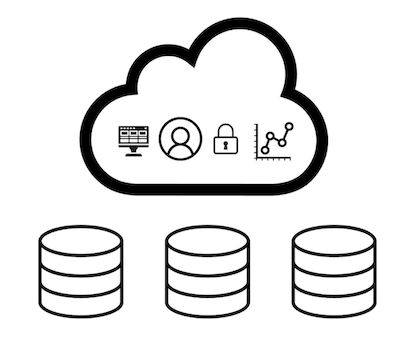
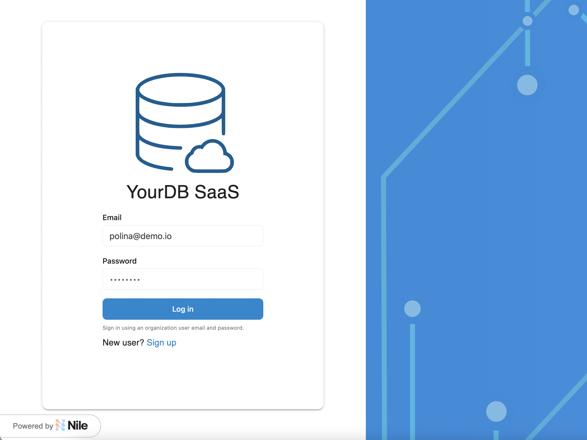
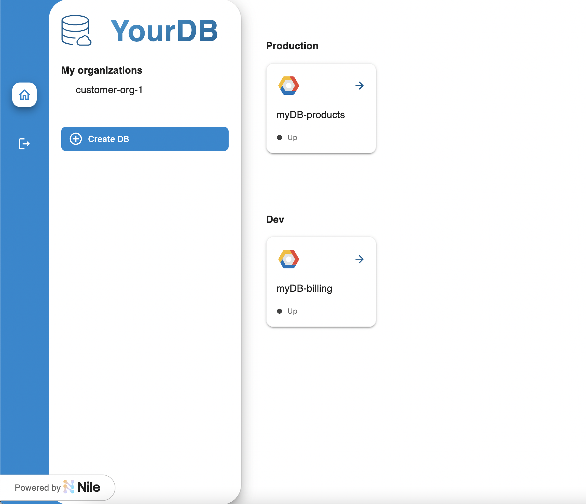
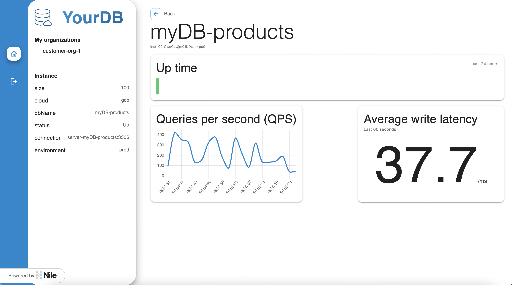

# Webapp Frontend


## Overview

This example shows a SaaS service integrated with [Nile](https://thenile.dev/). 
The mock scenario is a company that provides databases as SaaS which is using Nile for its control plane.



For this SaaS company, you define your example entity schema called `SaaSDB` in the file [SaaSDB_Entity_Definition.json](../quickstart/src/models/SaaSDB_Entity_Definition.json) that has a schema for each database instance.
Once a developer defines their service's entity schema, Nile provides web frontend with self-service (user signup/login, org creation, instance management), multi-tenancy, authorization policies, metrics, events for reconciling Nile with the data plane.

The sample webapp uses Nile React components for [Next.js](https://nextjs.org/) to create a frontend for a SaaS application integrated with [Nile](https://thenile.dev/).

## Contents

* [Overview](#overview)
* [Setup Certificates](#setup-certificates)
* [Install Dependencies](#install-dependencies)
* [Initialize Nile](#initialize-nile)
* [Run the web server locally](#run-the-web-server-locally)
* [Validate](#validate)

## Setup Certificates

1. Create certificates for your local machine and accept them. The Nile backend will only serve cookies to `\*.thenile.dev` domains, which is required for login

- Edit `/etc/hosts` and add `127.0.0.1 local.thenile.dev`.
- Run `mkdir .certificates && cd .certificates`
- Add an SSL key that lasts 1 year

   ```bash
   openssl req -x509 -out localhost.crt -keyout localhost.key \
     -days 365 \
     -newkey rsa:2048 -nodes -sha256 \
     -subj '/CN=*.thenile.dev' -extensions EXT -config <( \
     printf "[dn]\nCN=*.thenile.dev\n[req]\ndistinguished_name = dn\n[EXT]\nsubjectAltName=DNS:*.thenile.dev\nkeyUsage=digitalSignature\nextendedKeyUsage=serverAuth")
   ```

2. Open the certificate just created (`open localhost.crt`), and double click on the certificate in your keychain.

3. From the pop up window, open the dropdown for `Trust` and select `Always Trust`.

## Install Dependencies

```bash
yarn install
```

## Initialize Nile

To run these examples, you need to access to Nile. Please [reach out](https://www.thenile.dev) for more information.

1. For all examples, you need a local file with your Nile configuration.
For that purpose, at the top-level of the examples, copy the `.env.defaults` file to `.env`:

   ```bash
   # From the top level of the examples folder
   $ examples> cp .env.defaults .env
   ```

   Set the values in this `.env` file to match the values you want in your control plane.

2. Run the following command to preconfigure the Nile control plane with the mock SaaSDB use case so that you're not starting from scratch.

   ```bash
   yarn setup-nile
   ```

3. If you want to run with your own configuration, you need to edit or replace:

   - Nile connection configuration: [.env](.env) (see step above)
   - Entity schema: [SaaSDB_Entity_Definition.json](../quickstart/src/models/SaaSDB_Entity_Definition.json)
   - Pre-populate Nile with users: [userList.json](../quickstart/src/datasets/userList.json)
   - Pre-populate Nile with entity instances: [dbList.json](../quickstart/src/datasets/dbList.json)
   - Webapp column names and form fields derived from the entity schema: [FormFields.ts](components/EntityTable/FormFields.ts)
   - Webapp SaaS company logo: [saas-logo.svg](public/images/saas-logo.svg)

## Run the web server locally

Run the web server locally:

```bash
yarn dev
```

## Validate

1. As an end user: open [https://local.thenile.dev](http://local.thenile.dev) with your browser and log in as one of the predefine users from [userList.json](../quickstart/src/datasets/userList.json).

   The user login screen should resemble below:

   

2. Once logged in (e.g. as `nora@demo.io`), the user sees the entity instances (e.g. databases in this mock scenario) that she has access to.

   

3. Click on one of the instances to see metrics.

   

4. Logout. Then instead of logging in as an existing user, sign up as a new user.  Enter any email/password, then create an organization name.

5. Create a new SaaSDB instance.

6. As a Nile developer: log into the [Nile Admin Dashboard](https://nad.thenile.dev/) to see the control plane and entity instances.
For the email and password, use the `NILE_DEVELOPER_EMAIL` and `NILE_DEVELOPER_PASSWORD` values you specified in the `.env` file.

   Your dashboard should resemble below:

   
